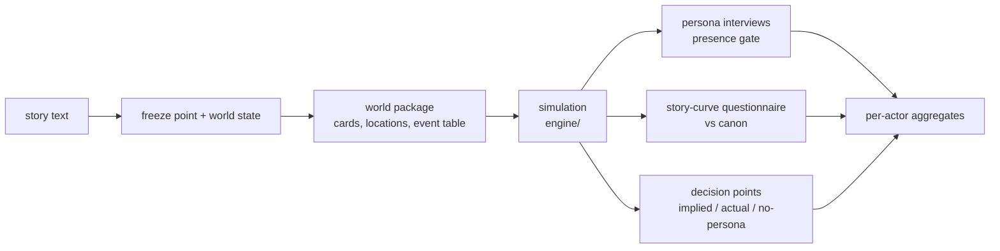

# ANIMASK

[](https://github.com/Xiucheng-Zhang/ANIMASK/actions/workflows/tests.yml)
[](LICENSE)
[](#installation)

Official code for **ANIMASK: What the Model Contributes to Role Play in
Simulated Story Worlds** (2026).

ANIMASK re-simulates a story with LLM role-playing agents and measures what
the persona contributes and what the underlying model contributes. A story is
cut at a freeze point and distilled into a world package; agents replay it on
a multi-agent engine; an LLM-judge chain scores the replay against the
original text and against the same model playing without the persona.

## Overview



Three measurements come out of a finished replay:

- **Persona presence.** At checkpoints of each character's acting sequence
  the live context is forked and the character is interviewed with a fixed
  battery; answers are scored against the card and gated before a character
  enters the decision-point pool. A knowledge audit at the first checkpoint
  checks for facts the character could not yet know.
- **Story curves.** Replay and canonical continuation are rated at five
  checkpoints on four seven-point scales and compared per actor model.
- **Decision points.** Each consequential choice receives three labels on a
  five-label action-strength scale (yield < hold < press < oppose < cross):
  what the persona card implies, what the character did, and what the same
  model does without the persona. Adherence, disagreement share, efficacy
  and shift follow from the three.

## Repository structure

```
animask/
  llm.py             LLM client: provider chosen from the model name, one .env
  resim/             pipeline: freeze point + world state, world package,
                     event table, batch runner (stage-gated, resumable)
  persona_probe/     evaluation chain: interviews + gate, knowledge audit,
                     story curves, decision points, per-actor aggregates
  scan_taint.py      quality gate: provider-side artifacts in actor replies
engine/              multi-agent simulation engine (run_resim.py)
tests/               191 tests; no network, no data needed
```

`animask/persona_probe/README.md` documents the evaluation chain and every
output schema; `engine/README.md` documents the engine's components.

## Installation

Python 3.10 or newer. The pipeline and the engine use the standard library
only; nothing has to be installed to run them.

```bash
git clone https://github.com/Xiucheng-Zhang/ANIMASK.git
cd ANIMASK
pip install -r requirements-dev.txt   # pytest and pypinyin, for the tests only
python3 -m pytest tests/
```

## Configuration

Credentials go in `.env` at the repository root (never committed):

```bash
cp .env.example .env
```

Every model call goes through `animask/llm.py`, which picks the provider
from the model name and reads that provider's key from `.env`:

| Model names | Provider | Key |
|---|---|---|
| `gpt-*` | OpenAI | `OPENAI_API_KEY` |
| `claude-*` | Anthropic | `ANTHROPIC_API_KEY` |
| `gemini-*` | Google Gemini | `GEMINI_API_KEY` |
| `deepseek-*` | DeepSeek | `DEEPSEEK_API_KEY` |
| `kimi-*` | Moonshot | `MOONSHOT_API_KEY` |
| `qwen*` | Alibaba DashScope | `DASHSCOPE_API_KEY` |
| anything else, or `compat:<name>` | any OpenAI-compatible server | `COMPAT_BASE_URL`, `COMPAT_API_KEY` |

A `provider:` prefix forces the route (`openrouter:openai/gpt-5.5`,
`compat:my-local-model`) and `<PROVIDER>_BASE_URL` overrides an endpoint.
Only the providers you call need a key. With the default settings a batch
calls OpenAI (extraction, world agent, cheap judge), DeepSeek (main judge) and
the provider of each actor model in the spec. The batch runner checks the
keys and the story files before it starts and lists anything missing.

## Data

The corpus used in the paper is not redistributable (copyrighted fiction and
unpublished scripts used with permission), so no story text ships here. The
pipeline runs on your own stories: one plain-text file per story at
`data/clean/<sid>.txt`, where `<sid>` is an identifier of your choosing
(letters, digits, underscores). Everything else, the freeze point, world
state, character cards and event table, is extracted by the pipeline and
cached under `data/meta/`, `data/cache/` and `engine/data/`.

A batch is a JSON spec with one entry per (story, condition):

```json
[
  {"sid": "story01", "language": "en", "runs": 1},
  {"sid": "story01", "language": "en", "runs": 1, "actor_model": "claude-sonnet-5"},
  {"sid": "story02", "language": "zh", "runs": 1, "persona": "P0"}
]
```

`actor_model` is the model that plays the characters (default
`gpt-5.6-sol`), `persona` is `P3` (full character card, default) or `P0`
(persona-free), `judge_model` overrides the terminator judge, `runs` is the
number of replicates. Conditions are folded into the run tag
(`<batch>_<condition>_r<k>`), so arms of the same story never overwrite each
other. `animask/resim/spec_example.json` is a complete example.

## Quick start

All commands run from the repository root.

**1. Build and simulate.** Every stage is skipped when its artifact exists,
so the command can be stopped and relaunched at any time.

```bash
python3 -m animask.resim.batch_runner mybatch --spec animask/resim/spec_example.json
```

Per story: freeze point and world state (`animask.resim.extract_state`),
world package (`animask.resim.build_world_pack`), event table
(`animask.resim.extract_processes`); then one simulation per run
(`engine/run_resim.py`) and the persona interviews on each finished run
(`animask.persona_probe.run_persona_probe --layers l2`).

**2. Evaluate the batch.** Story-curve questionnaires on replay and canon,
decision-point scan and labels, presence profile with its gate, knowledge
audit, curve comparison:

```bash
python3 -m animask.persona_probe.run_eval mybatch
```

**3. Five-label decision points.** Relabel the scanned points on the
action-strength scale and pool them per actor model:

```bash
python3 -m animask.persona_probe.run_b1v2_all mybatch_r1 mybatch_claudesonnet5_r1
python3 -m animask.persona_probe.b1v2_decisions --aggregate mybatch
```

The first command takes the run tags of the batch as printed by the batch
runner; the second writes the per-actor table.

### Outputs

| Path | Content |
|---|---|
| `results/batch/<batch>/` | `state.json` (stage status per story), `logs/`, `usage.jsonl` (token accounting) |
| `results/runs/<sid>__oracle/` | per run: `transcript_<tag>.json`, `run_meta_<tag>.json` (models, temperatures, seed, termination), `llm_calls_<tag>.jsonl` (every model call), `persona_probe_<tag>.json`, `b1_decisions_<tag>.json`, `b1v2_decisions_<tag>.json`, `curves_<tag>.json` |
| `results/persona_probe/` | per batch: `facets_<batch>.json` (presence profile and gate), `leak_audit_<batch>.json`, `curves_<batch>.{json,md}` (dispersion, paired deviations, permutation p with Holm correction), `b1_<batch>.{json,md}` (eight-class labels, kept for comparison), `b1v2_<batch>.{json,md}` (adherence, disagreement share, efficacy, shift, with story-clustered bootstrap intervals) |

## Reproducing the paper

The three commands above are the paper's pipeline. The paper's runs used
the models and settings below; all of them are the defaults of the code
unless a flag is named.

| Role | Model |
|---|---|
| Actors (six arms) | `gpt-5.5`, `claude-sonnet-5`, `gemini-3.7-flash`, `deepseek-v4-flash`, `kimi-k2.6`, `qwen3.7-plus` |
| Extraction, world agent, archivist | `gpt-5.6-sol` |
| Terminator judge and evaluation judges | `deepseek-v4-pro` |
| Interview second rater | `gpt-5.6-luna` |

| Setting | Value | Where |
|---|---|---|
| Sampling temperature | actors 0.7; world agent, archivist, judges 0 | `run_resim.py --actor_temperature` |
| Simulation budget | 2 sub-rounds per round; 12 rounds plus 6 per expected time skip, at most 40; 6 h wall clock per run | `--sub_rounds`, `--max_rounds`, batch runner |
| Standstill | replay closes after 2 rounds without material change | `engine/modules/terminator.py` |
| Interviews | 5 checkpoints, 2 wordings per question | `run_persona_probe --l2-checkpoints --l2-paraphrases` |
| Presence gate | traits-and-values and relations at or above 80 at 80% of checkpoints | `facet_profile.py` |
| Story curves | 5 checkpoints, scale 1 to 7 | `story_curves.py` |
| Decision scan | 2 votes per round, at most 3 points per round | `b1_decisions.py` |
| Statistics | story-clustered bootstrap, 2000 resamples for decision rates and 1000 for curves; paired permutation, 2000 draws, Holm across the four scores; seed 0 | `stats.py`, `curve_compare.py`, `b1v2_decisions.py` |
| Reasoning | switched off for DeepSeek and Moonshot models | `animask/llm.py`, `LLM_THINKING` |

Two caveats. Sampling at temperature 0.7 is not reproducible bit for bit;
the seed recorded in `run_meta` labels a replicate rather than fixing the
provider's sampling. And the paper's corpus is not included, so the numbers
reproduce on a corpus of your own, not the paper's tables.

## Citation

```bibtex
@article{animask2026,
  title   = {ANIMASK: What the Model Contributes to Role Play in Simulated Story Worlds},
  author  = {Zhang, Xiucheng and Xu, Zhuoning and Luo, Hanjun and Chen, Yankai and Salam, Hanan and Liu, Xue},
  year    = {2026},
  url     = {https://github.com/Xiucheng-Zhang/ANIMASK}
}
```

`CITATION.cff` carries the same entry in machine-readable form.

## Contributing and contact

Issues and pull requests are welcome; see `CONTRIBUTING.md`. Changes are
tracked in `CHANGELOG.md`. Contact: Xiucheng Zhang, xz5473@nyu.edu.

## License

Apache-2.0 (see `LICENSE`). Parts of `engine/` derive from BookWorld
(https://github.com/alienet1109/BookWorld, Apache-2.0); those files carry a
modification notice.
